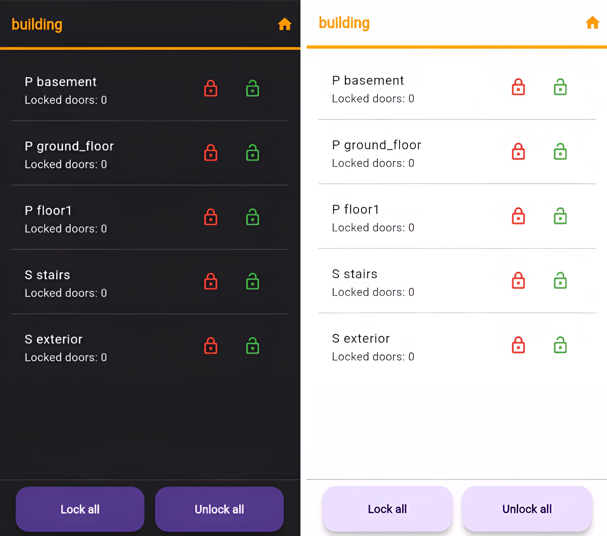
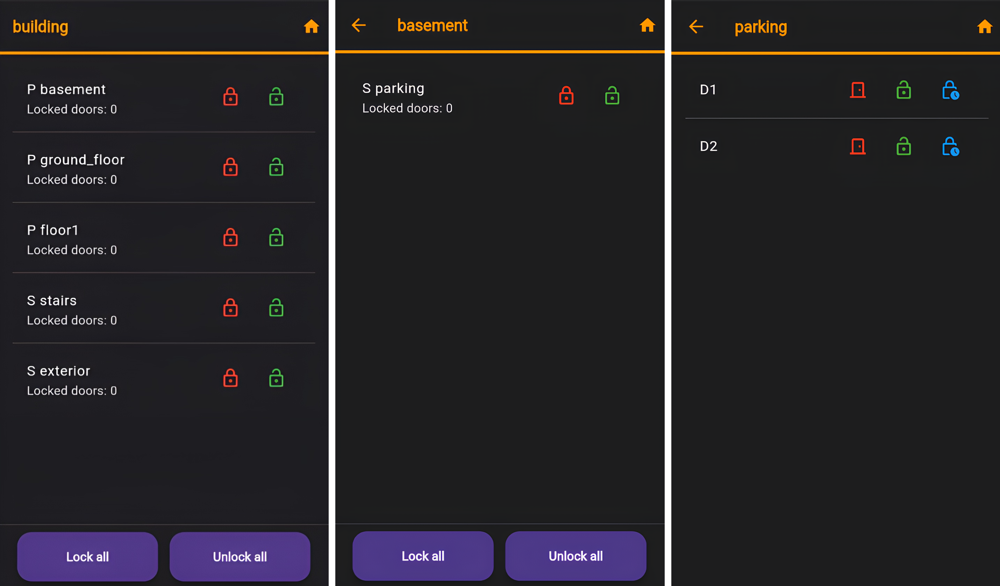
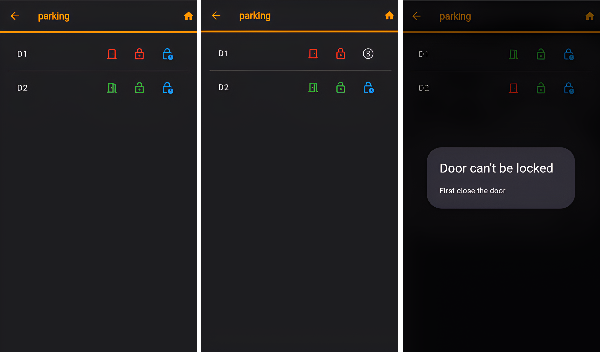

# Access Control System

This project need the web server to works, it's available in this repository [ACS webserver](https://github.com/R0drigo-0/ACS-webserver)

It allows you to interact with the server through an application made in Flutter.

This application can interact with the doors of a building, it can select between **Doors**, **Spaces** and **Partitions**.

The app was programed to desing **internationalization** (i18n) and **localization** (l10) by the devices parameters, like the language or if the dark theme is activated.

### The doors have the following functions:
* **Open/Close:** If the door is open the icon is green, otherwise is red.  
* **Lock/Unlock:** If the door is locked the icon is green, otherwise is red.
* **Unlock shorly:** If the door is locked it can be unlocked for 10 seconds, where the icon specify the time.

### Images
#### Dark and white theme

#### Multiple languages

#### Select doors 

#### Actions doors

